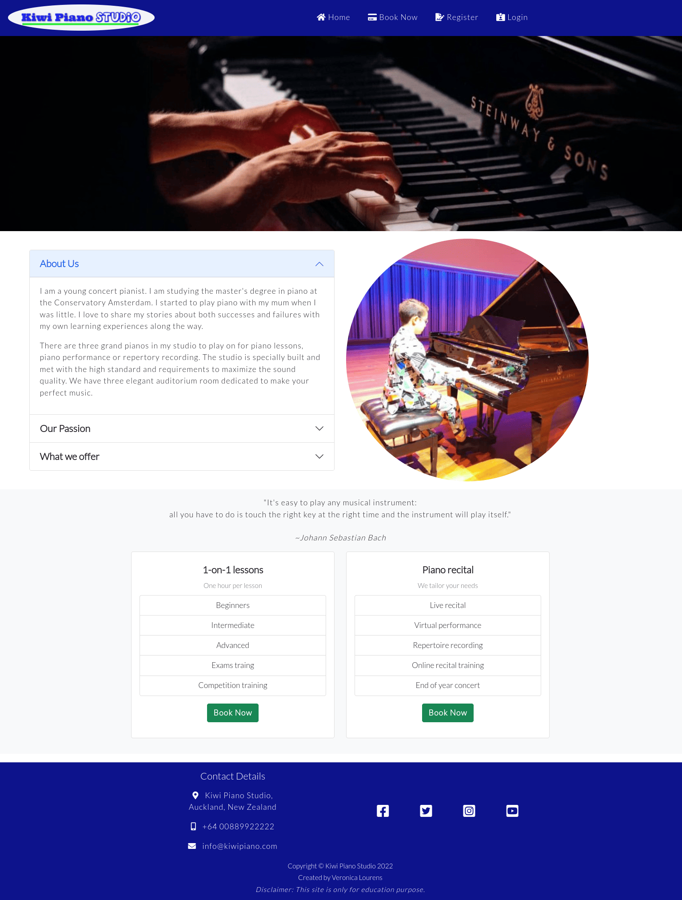
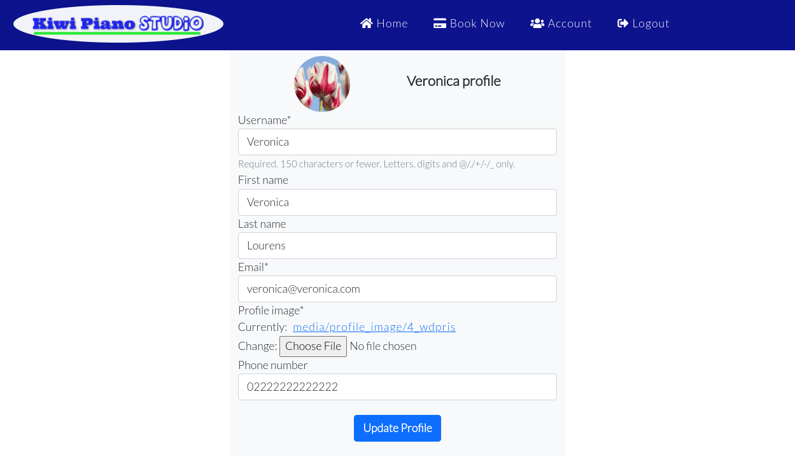
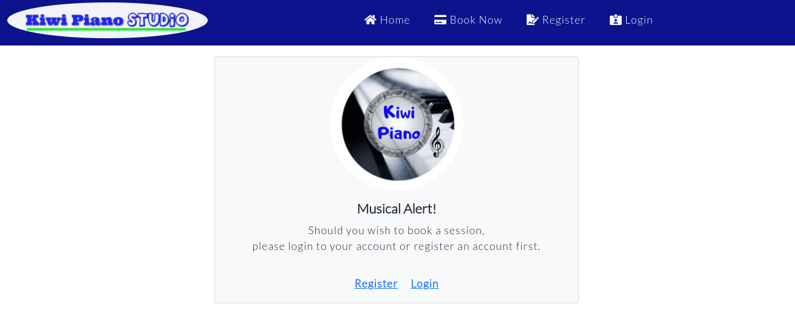
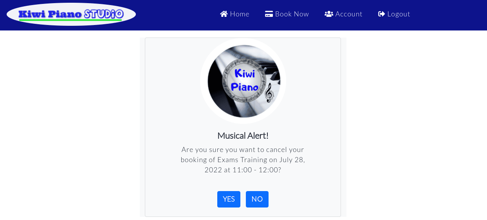
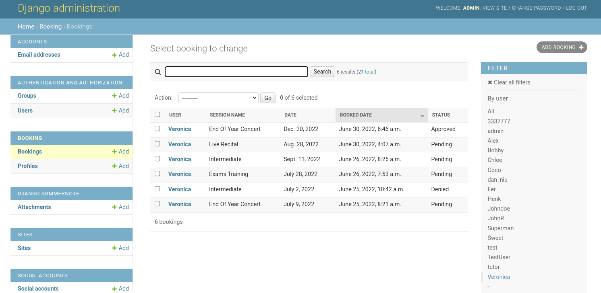

# Kiwi Piano Studio

Kiwi Piano website targets the user who wants to learn to play piano, or wants to play music piece on a grand piano, or wants to make a recording, or wants to practice for music competition, or wants to perform a piano virtual recital, or simply enjoys a play in a small concert-like environment. 

The website provides different user interface. User can register an account, login to the user’s account, log out from the account, edit profile or delete account, book or cancel a session. Admin user can manange the site's data. 

[Kiwi Piano Studio](https://kiwipiano.herokuapp.com/) live site.

## Table of Content

# UX

## User Stories

* ### Admin CRUD / Super User
  * [#1]() As an admin I can navigate the admin panel so that I can create, read, update and delete the data on the site.
  * [#2]() As an admin I can use the admin privilege so that I can filter out and approve the comments that user wants to post on site

* ### New and unregistered User
  * [#3]() As a first time user I can access the site easily so that I can view the site on any media screens with different browsers.
  * [#4]() As a first time user I can navigate the site easily so that I know what the site is about and decide if I am interested or not.
  * [#5]() As a user I can view the range of session so that I can choose a session that it is suitable for me.
  * [#6]() As a user I can view the session schedule so thatI can book a session available to fit into my own schedule.
  * [#7]() As a user I can sign up an account so that I can manage my activities with the studio.

* ### Registered User
  * [#8]() As a registered user I can login / logout so that I can book or cancel a session as well as managing my own account profile.
  * [#9]() As a registered user I can book a session so that I can select a session suitable for me.
  * [#10]() As a registered user I can cancel a booking so that I can manage my schedule in case I am not available.
  * [#11]() As a user I can receive feedback so that I know whether my registration is successful or not, whether my profile is updated or not, and my booking status.
  * [#12]() As a register user I can view my booking history so that I have a clear view about my study.
  * [#13]() As a registered user I can post a review so that I can share my opinion about my experience with the studio.
  * [#14]() As a user I can contact the studio so that I can ask any questions regarding my bookings or other things.
  * [#15]() As a registered user I can view and edit my profile so that I know my account details and I can edit and manage my own account as I wish.

[Back to top](#kiwi-piano-studio)

## Site Owner Stories

* The website is accessible and responsive. It targets the user who would like to learn to play piano or other activities using the studio.

* The site offers different user interface that user can sign up an account, log in and log out as well as edit the user profile. 

* The site has a booking system that user can book a piano session according to user’s interests.

* The site offers user a platform that user can create and post a review about their experience with the piano studio. 
  
* The site offers registered user to view and edit their account profile.

* The site offers many different contact methods that user can make contact easily to the piano studio.

* The site has an admin functionality that admin can manage the site.

[Back to top](#kiwi-piano-studio)

## Wireframes

I used Balsamiq to create the project’s wireframes that displays an overview of how the site looks like. However, the end result might be slightly different than the initial design due to the development of the project.

  * Home page
  

  [Back to top](#kiwi-piano-studio)
    

  * <details><summary>The sign up page.</summary>

    

    </detials>


* <details><summary>The sign up feedback page.</summary>
  
  

  </detials>

* <details><summary>The Login page.</summary>
  
  

  </detials>


* <details><summary>The booking page.</summary>
  
  

  </detials>


* <details><summary>The booking confirmation page.</summary>
  
  

  </detials>

[Back to top](#kiwi-piano-studio)  

## Agile Project Management

I used GitHub’s agile project management methodology for managing the work flow of the project. The user stories were created using the Issues. With the ```MoSCoW``` techniques, the user stories were listed on Projects’ Kanban board and were labeled to prioritize the requirements. They would be moved across the board from ```To do```, ```In progress``` and ```Done``` in the end when all the tasks are completed.

Combine with the project’s scope, personal learning progress, I set the Issues with ```Must have``` label just under half of the total Issues. This helps me managing the time and the workload. Learning to use Agile in the first time to create the project.

[Back to top](#kiwi-piano-studio)


[Back to top](#kiwi-piano-studio)


* ### Sprint 1:

  * Explore Design Thinking into the project’s scope. Ask myself and families why one wants to be a member and book a session with the piano studio.
  
  * Make notes about a list of project’s features to be included and the amount of pages to be made which are Home page, Reviews page, Sign up page, Login page, Bookings page, confirmation page, payment page. 
  
  * List the technologies would be used for the project.
  
  * Sketch the design on paper, modify and adjust the features, then create project’s wireframes.
  
  * Prepare the content for the site which I download images on the internet and make reference about the resources. Write the content of the reviews with author’s names and dates etc.
  
  * Determine the image to extract the color theme and create the color contrast and select the typography for the site. 

  **Note**: Some features and pages would not be implemented for this project due to the limitation of my current knowledge and skills. 

[Back to top](#kiwi-piano-studio)

* ### Sprint 2:
      
  * Create GitHub repository, Project and Issues. Use the agile project management MoSCow techniques to prioritize the project’s approximate workload for each sprint. 
  
  * Create Entity Relational Diagram (ERD) and collect the information to help me better understand how database works. 
  
  * Create the README.md file to document the project’s development by adding a basic structure and the completed work until this point.
  
  * Install Django and the required packages. Create a Django project and a super user /admin account. Complete the user stories #1 Admin CRUD-1.
  
  * Create Heroku app and attach the PostgreSQL to the app. Deploy the project to Heroku via CLI and test Django and deploy the app to see the result.

[Back to top](#kiwi-piano-studio)

* ### Sprint 3:
  * Create a new "booking" app on Gitpod.
  * Install Django Summernote and set up Admin account.
  * Complete the user stories [#1]() ```Admin CRUD-1``` tasks.
  * Create a basic template base.html to render the view. 
  * Target user stories [#5]() ```View the range of sessions```,  create home page with session list and render the view. 
  * Create the booking Model and connect URLs.
  * Add Bootstrap classes and CSS code to style the template.

[Back to top](#kiwi-piano-studio)

* ### Sprint 4:
  * Set up basic authentication using allauth.
  * Target user stories [#7]() ```User account registration```.
  * Create profile model, user profile form.
  * Create account registration view.
  * Target user stories [#8]() ```Loing / logout```.
  * Target the user stories [#11]() ```Receive feedback```.
  * Target user stories [#15]() ```View and edit user profile```.

* ### Sprint 5:
  * Target the user stories [#9]() ```Book a session```.
  * Create booking form details page.
  * Target the user stories [#10]() ```Cancel the booking```.
  * Target the user stories [#12]() ```View booking history```.

[Back to top](#kiwi-piano-studio)

* ### Sprint 6:
  * Target the user stories [#3]() ```Access the site```.
  * Target the user stories [#4]() ```Navigate the site```.
  * Target the user stories [#14]() ```Contact the studiio```.
  * Create the hero image and about section on the home page.
  

## Design

### Color Scheme

The site uses white color for the background and black color for the text. The bright colors are used for the buttons and links.

* Color source image
  <details><summary>The color theme was extracted from this image.</summary>

  

  </detials>

* Colors for the site

  


  <details><summary>The color grid.</summary>

    

    </detials>


[Back to top](#kiwi-piano-studio)

### Typography

The site uses the main font-family ```Lato``` for the content and ```Open-sans``` for the fall back. The logo uses a special font ```Ultra``` that makes the logo text bold. 

### Data Model

The data chart helps to see how the user's experiences looks like.


[Back to top](#kiwi-piano-studio)

### Database ERD

ER diagram was created using Lucidchar that maps the database structure for creating models in Django. The ERD helps me to visualize the relationships between the tables which gives me better idea on how the database works for the project development.

The model name Lesson is called ```Session``` in the project.


[Back to top](#kiwi-piano-studio)


# Exsiting Features

* ## Home Page

  The home page contains navigation header, hero image, about section, session list and footer. User is able to view all the info about ```Kiwi Piano Studio```.

  The tabs are displayed ```Home Register Login``` when the user isn't logged in. The tabs are changed to ```Home Profile Logout``` when the user is logged in.

  


* ## Register Page

  The register page contains a user registration form that asks user to fill in the user name, email address and password. User gets a confirmation after registering an account. The user data is saved in the database.

  * Register form
  
    

  * Registration feedback

    

[Back to top](#kiwi-piano-studio)

* ## Login Page

  The login page contains a message and a form for user to fill in. User is redirected to the home page after logging in to the account.

  * Login form
  

  * Login confirmation

  

[Back to top](#kiwi-piano-studio)

* ## Profile Page
  The profile page displays user's personal information such as username, email, first name, last name, user's profile image, phone number. User is able to update all of the personal details. The updated data is also updated in the database in the same time. User is able to delete the account with all the data from the database. User is redirected to the page where it gives user an alert message that ask user to confirm the delete process. There is a booking list that shows the bookings user has made.

  * Profile form
    

  * Profile update confirmation

    

  * Delete profile alert

    


  [Back to top](#kiwi-piano-studio)

## Bookings Page

User gets an alert message when clicking "Book Now" button while not logged in. User is able to use the booking form to book a session that user can select a session, date, start time and end time. User gets a confirmation afterwards. User can update the booking details or cancel the booking. There is an alert when user selects cancel the booking. User is redircted to the profile page after cancelling the booking.

* Booking alert
    

    [Back to top](#kiwi-piano-studio)

* Booking form
  

  [Back to top](#kiwi-piano-studio)

* Booking success
  

  [Back to top](#kiwi-piano-studio)

* Booking details
  

  [Back to top](#kiwi-piano-studio)

* Booking update form
  

  [Back to top](#kiwi-piano-studio)
 
* Booking update success
  

  [Back to top](#kiwi-piano-studio)
  
* Booking cancel alert
  

  [Back to top](#kiwi-piano-studio)

* Booking cancel success
  

  [Back to top](#kiwi-piano-studio)

## Admin Site

The admin / super user is able to navigate the admin panel to manage the data.

* User list
  

  [Back to top](#kiwi-piano-studio)

* Delete user
  

  [Back to top](#kiwi-piano-studio)

* Delete user success
  

  [Back to top](#kiwi-piano-studio)

* Booking list filtered by one user
  

  [Back to top](#kiwi-piano-studio)

* Booking list of all users
  


[Back to top](#kiwi-piano-studio)
## Future Development

# Technologies Used

* [HTML5]()
* [CSS]() 
* [JavaScript]() 
* [Python]() 

* [Bootstrap]() - used to style the websie.
* [Django]() - used to create the project.
* [Heroku]() - used to deploy and host the project's live site.
* [Heroku]() PostgreSQL - used to connect the project to the database.
* [Cloudinary]() - used to store project's static and media files.
* [Summernote]() - used to add the editor with full feature.
  
* [GitHub]() - used to host the project's code and make deployment.
* [GitPod]() - used to write the code for the project.
* [Balsamiq]() - used to create project's wireframes.
* [Chrome Dev Tools]() - used to debug and light house testing.
* [Am I Responsive]() - used to generate the responsive preview screens.
* [Responsive Design Checker]() - used to check responsiveness.
* [Lucidchart]() - used to create the database ER diagram.
* [Font Awesome]() - used to download the icons.
* [Google Fonts]() - used to style the text.
* [JSHint]() - used to validate the JavaScript code.
* [Pep8]() - used to validate the Python code.
* [W3C Markup Validation Service]() - used to validate the HTML code.
* [W3C CSS Validation Service]() - used to validate CSS code.
* [Compressor.io]() - used to compress the images and screenshots.

[Back to top](#kiwi-piano-studio)

# Testing

## Code Validation

## Responsiveness Test

## Browser Compatibility Test

## Automated Tests

## Light House Test

## Manual Test

## Resolved Known Bugs

## User Story Test

## Bugs

# Deployment

1. I used Code Institute GitPod full template to set up an environment to created the project. Installed ```Django``` and required packages / libraries using commands in GitPod terminal. Created a project named ```kiwipiano``` and connected the project to use ```Cloudinary``` and ```PostgreSQL```.

2. Logged in to Heroku account and created an app named kiwipiano.
Attached the database to the app and set up the Config vars.

3. Created ```env.py``` file and ```Procfile```, updated ```settings.py``` file and then made migrations to the database for all the changes.

4. Commands to deploy ```kiwipiano``` project in GitPod terminal:
   
    * ```heroku login -i``` ---login to my Heroku account.
    * ```heroku apps``` ---get the names of Heroku apps.
    * ```heroku git:remote -a kiwipiano``` ---set the Heroku remote.
    * ```git add . && git commit -m "Deploy project to Heroku via CLI."``` ---add and commit.
    * ```git push origin main``` ---push to GitHub repository.
    * ```git push heroku main```---push to Heroku.

5. Deployment successful. Here is the site's URL: https://kiwipiano.herokuapp.com/

* <details><summary>Deployment to Heroku successful</summary>

    

    </detials>
   
   
[Back to top](#kiwi-piano-studio)

# Credits

## Content

* The code for the admin panel features and functions are taken from [Code Institute]()'s walk through project ```I Think Therefore I Blog```.

## Media

* [Unsplash]() - used to download the images for free.
* [Pexels]() - used to download the images for free.
* [Adobe Color]() - used to extract the site's color theme.
* [Eighshapes]() -used to make the contrast grid.
* [Compressor.io]() - used to compress images and screenshots.
* [MDN Web Docs]() - used to get reference materials.
* [Stack Overflow]() - used to search for code related errors and bugs.
* [Slack]() - used to connect with fellow coders and get help whenever I am stuck.

## Code

* The site's login / logout were inspired by [Corey Schafer]() that I watched his Django Tutorials on [Youtube]() to learn more about how to build apps using Django.

* The codes of signals.py are taken from here [Django signals](https://dev.to/earthcomfy/django-user-profile-3hik).

# Acknowledgement

Whilst I have tried to deviate as much as possible, there might be some similarities in the code as the project was influenced by the walk through Django project ```I Think Therefore I Blog``` at Code Institute. Setting up Django and the packages that I followed by the walk through project.

I relied upon the support from Code Institue online [tutors](), mentor [Precious Ijege](), [Slack]() community and my [families](). Special thanks to [Daniel Callaghan]() for his great help during my project development. Daniel gave me awesome tips to better understand how Django MVT works and he explained the code logic which I have learned a lot more about Django framework. Great thanks to all of those who support my learning journey.

I use Django documentation, W3schools, YouTube and stack overflow for general references throughout the project. I watched the tutorial videos on Youtube to gain extra knowledge about Django framework.

[Kiwi Piano Studio](https://kiwipiano.herokuapp.com/) website is intended for education purpose of completing the Portfolio Project 4 for the Diploma of Full Stack Software Development course at [Code Institue]().

[Back to top](#kiwi-piano-studio)