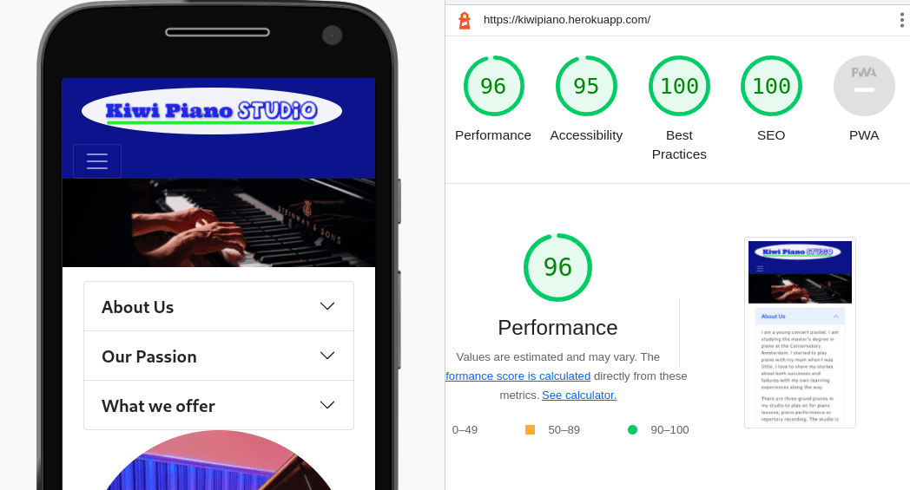
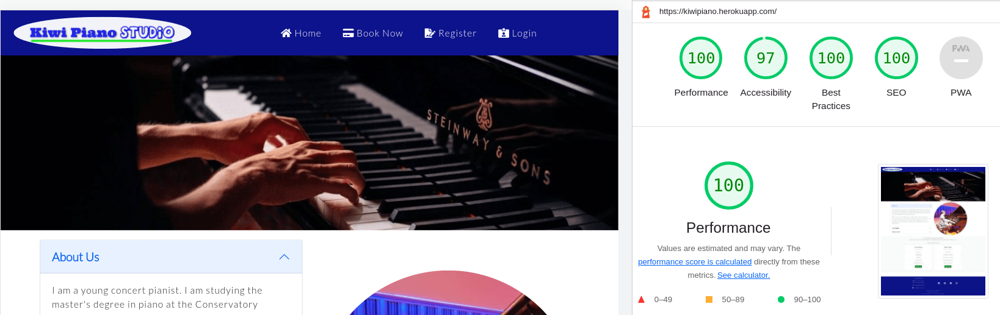
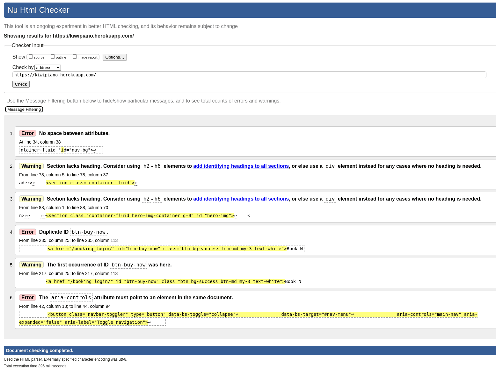

# TESTING

## Code Validation

 The site's HTML, CSS and Python codes are validated by the W3C HTML & CSS Validation Service and PEP8 ONLINE service.

* W3C HTML Validation Report
 
 [Back to top](#kiwi-piano-studio)
* W3C CSS Validation Report
  
  [Back to top](#kiwi-piano-studio)
* PEP8 online
  
  [Back to top](#kiwi-piano-studio)

## Responsiveness Test

## Browser Compatibility Test

Kiwi Piano Studio website has been tested on **Google Chrome**, **Microsoft Edge** and **Safari** browsers. The site's compatibility and the functionality are working fine with no issues.

[Back to top](#kiwi-piano-studio)
## Lighthouse Testing

The site is tested on ```Google Chrome Lighthouse``` function on incognito window for both the mobile and the desktop.

* Lighthouse report for the mobile
  

[Back to top](#kiwi-piano-studio)
* Lighthouse report for the desktop
  


## Manual Test

## Resolved Known Bugs

  There were some bugs and warnings after checking the markup code by the W3C Markup Validation Service. To solve the problems, I deleted the "id", changed aria-controls attribute, put the space in the nav div tag, and changed the section tag to div on serveral HTML files.

  There were 278 warnings after checking the Python code in views.py fiel using PEP8 online due to the trailing spaces and too many blank lines in between. Then I deleted all the trailing spaces and the blank lines to solve all the warnings. In the end, all errors and warnings are resolved.

  * <details><summary>Known bugs.</summary>

    

    </detials>

  [Back to top](#kiwi-piano-studio) 

## User Story Test
