# TESTING

## Table of Content


- [TESTING](#testing)
  - [Table of Content](#table-of-content)
  - [Code Validation](#code-validation)
  - [Responsiveness Testing](#responsiveness-testing)
  - [Browser Compatibility Testing](#browser-compatibility-testing)
  - [Lighthouse Testing](#lighthouse-testing)
  - [Manual Testing](#manual-testing)
  - [Automated Testing](#automated-testing)
  - [Resolved Known Bugs](#resolved-known-bugs)
  - [User Story Testing](#user-story-testing)
  - [Site Owner Stories Testing](#site-owner-stories-testing)


## Code Validation

 The site's HTML, CSS and Python codes are validated by the W3C Markup Validation Service, W3C CSS Validation Service and PEP8 ONLINE service.

* ### W3C HTML Validation Report
  
 [Back to top](#testing)

* ### W3C CSS Validation Report
  
  [Back to top](#testing)

* ### PEP8 online / views.py
  
  [Back to top](#testing)

* ### PEP8 online / apps.py
  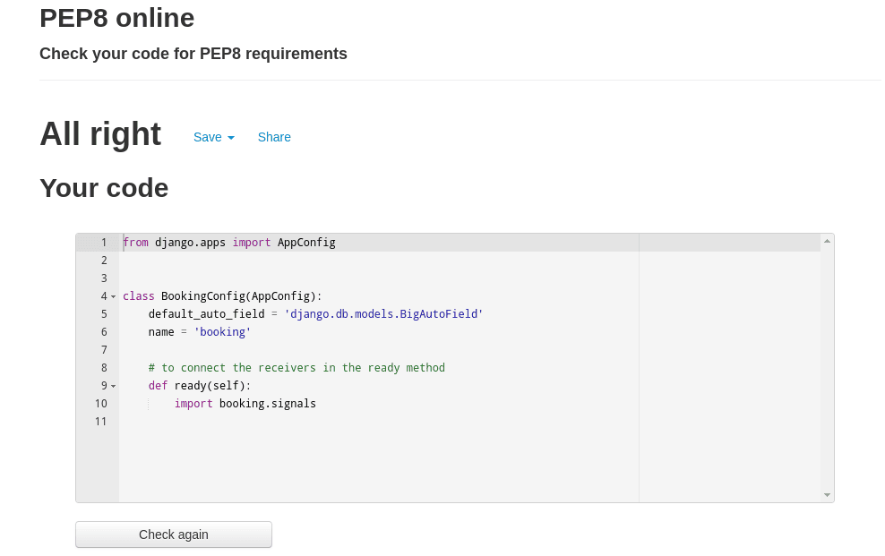
[Back to top](#testing)

* ### PEP8 online / forms.py
  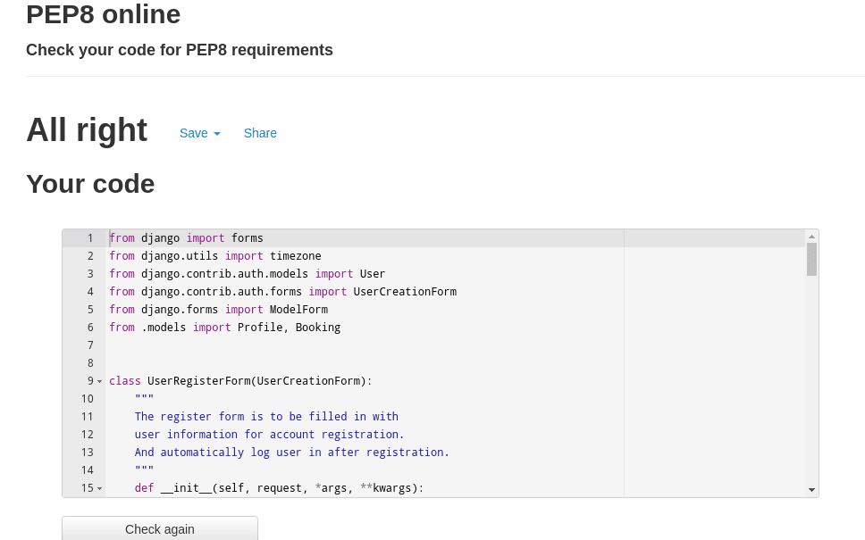
[Back to top](#testing)

* ### PEP8 online / models.py
  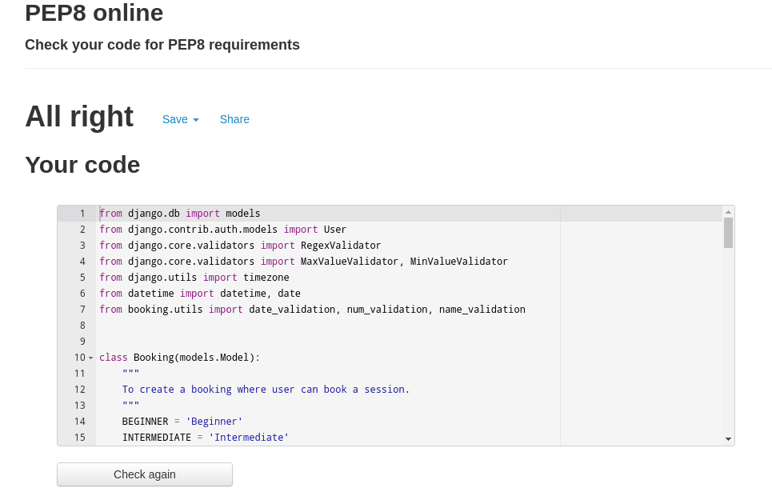
[Back to top](#testing)

* ### PEP8 online / signals.py
  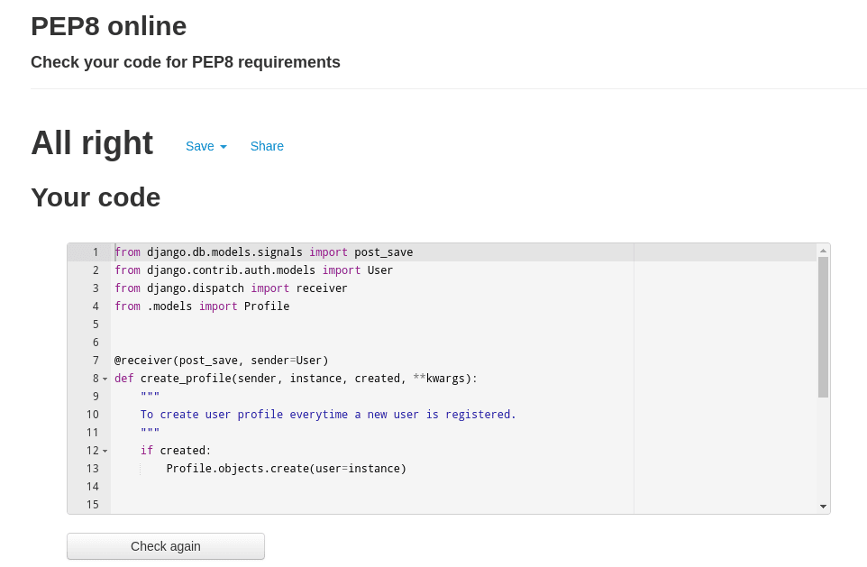
[Back to top](#testing)

* ### PEP8 online / urls.py
  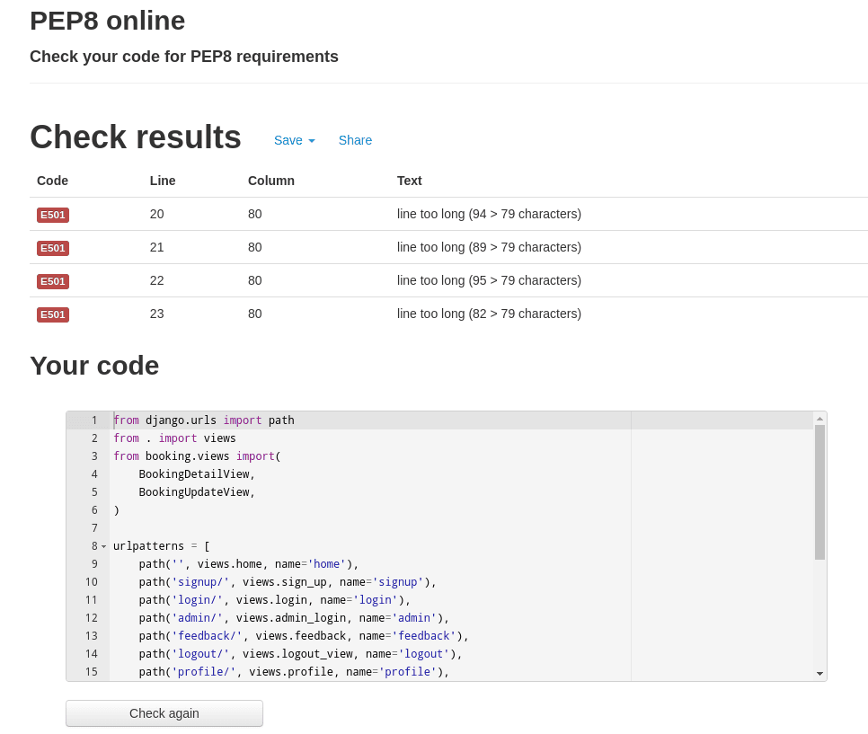
[Back to top](#testing)

* ### PEP8 online / utils.py
  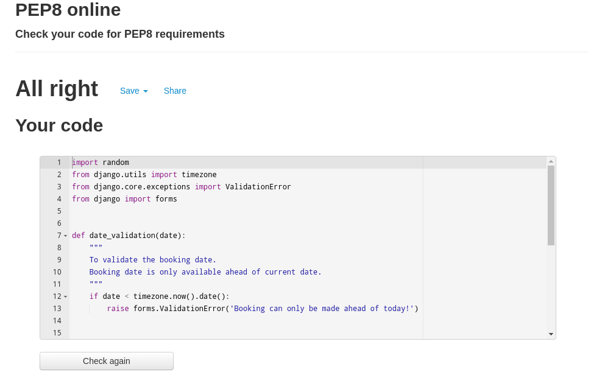
[Back to top](#testing)


## Responsiveness Testing

* The website has been manually tested and passed on the **Google Chrome Dev Tools** and the **Responsive Design Checker**.

  |       | **Moto G4** | **Galaxy S5** | **iPhone 5** | **iPad** | **iPad Pro** | **Display < 1200px** | **Display <= 4000px** |
  |-------|:-----------:|:-------------:|:------------:|:--------:|:------------:|:--------------------:|:---------------------:|
  |Render |  &check;    |   &check;     |   &check;    |  &check; |    &check;   |        &check;       |        &check;        |  
  |Image  |  &check;    |   &check;     |   &check;    |  &check; |    &check;   |        &check;       |        &check;        |   
  |Links  |  &check;    |   &check;     |   &check;    |  &check; |    &check;   |        &check;       |        &check;        | 

[Back to top](#testing)

  * The website has been tested and passed on my own devices. It is fully responsive on two desktops, two laptops, iPad Air and  three mobile phones while using Google Chrome, Microsoft Edge and Sarari browsers.

  |       |**Galaxy Note4**|**Nokia 7 Plus**|**Huawei P30 Pro**|**iPad Air**|**Lenovo E540**|**HP Elitebook 850 G5**|**DELL 2407WFP**|**Yiyama ProLite XB3288UHSU**|
  |-------|:--------------:|:--------------:|:----------------:|:----------:|:-------------:|:---------------------:|:---------------:|:--------------------------:|
  |Render |    &check;     |   &check;      |      &check;     |   &check;  |    &check;    |        &check;        |     &check;     |        &check;             |
  |Image  |    &check;     |   &check;      |      &check;     |   &check;  |    &check;    |        &check;        |     &check;     |        &check;             |
  |Links  |    &check;     |   &check;      |      &check;     |   &check;  |    &check;    |        &check;        |     &check;     |        &check;             |

## Browser Compatibility Testing

Kiwi Piano Studio website has been tested on **Google Chrome**, **Microsoft Edge** and **Safari** browsers. The site's compatibility and the functionality are working fine with no issues.

[Back to top](#testing)
## Lighthouse Testing

The site's pages are tested on ```Google Chrome Lighthouse``` function on incognito window for both the mobile and the desktop.

* ### Home page
  * Lighthouse report for the mobile
  

  [Back to top](#testing)
  * Lighthouse report for the desktop
  

  [Back to top](#testing)

* ### Register page
  
  * Mobile
  
    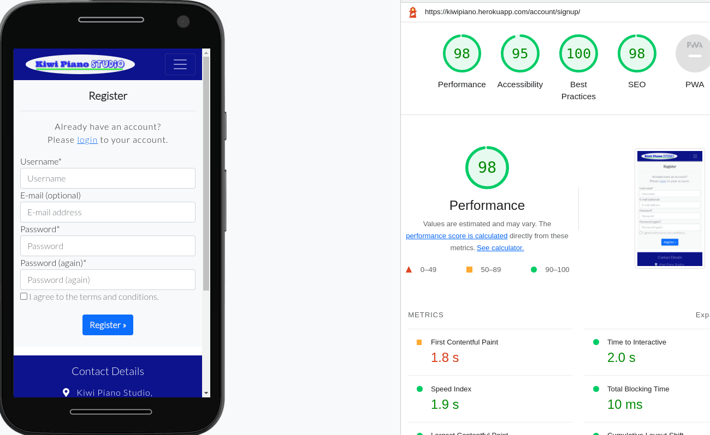

  * Desktop
  
    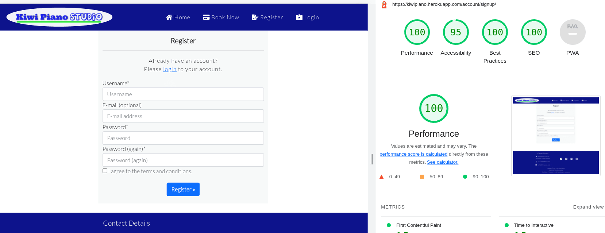

  [Back to top](#testing)
* ### Login page
  
  * Mobile
  
  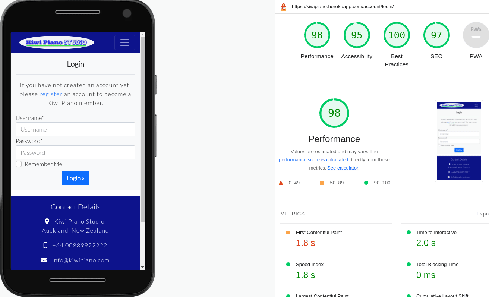

  * Desktop
  
  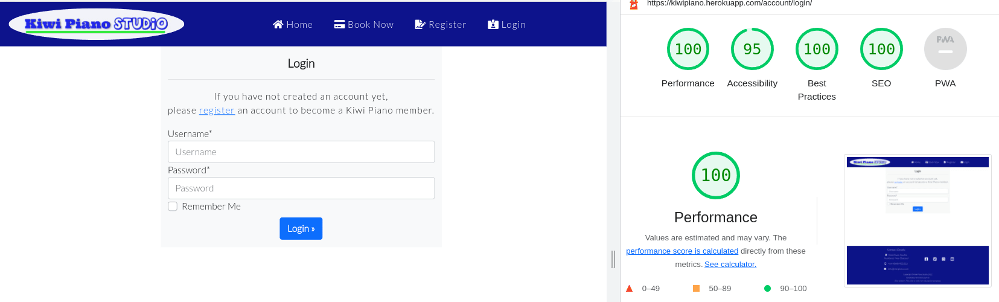

  [Back to top](#testing)
* ### Profile page
  
  * Mobile
  
  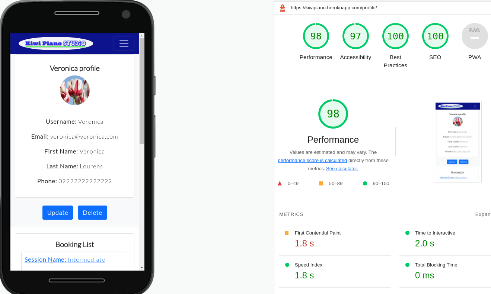

  * Desktop
  

[Back to top](#testing) 

* ### Booking alert page
  
  * Mobile
  
  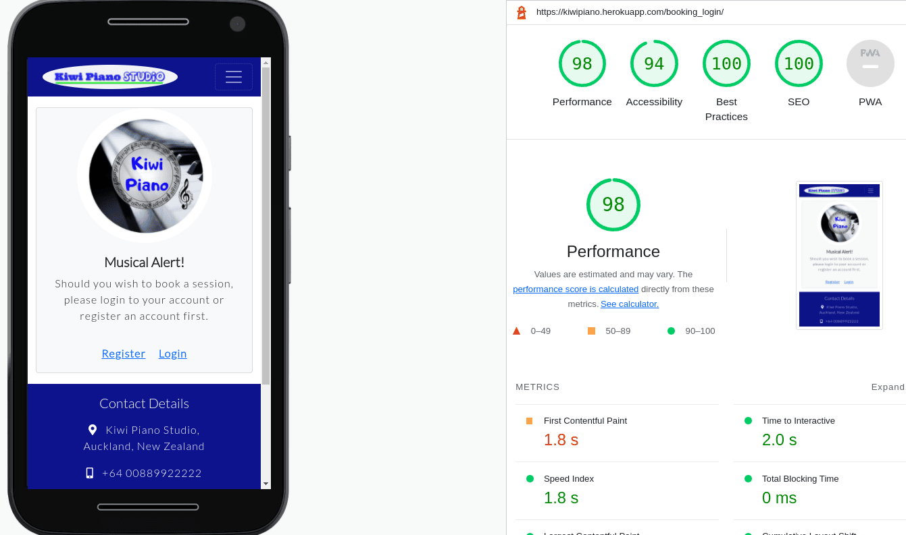

  * Desktop
* 
  

  [Back to top](#testing)
* ### Booking form page
  
  * Mobile
  
  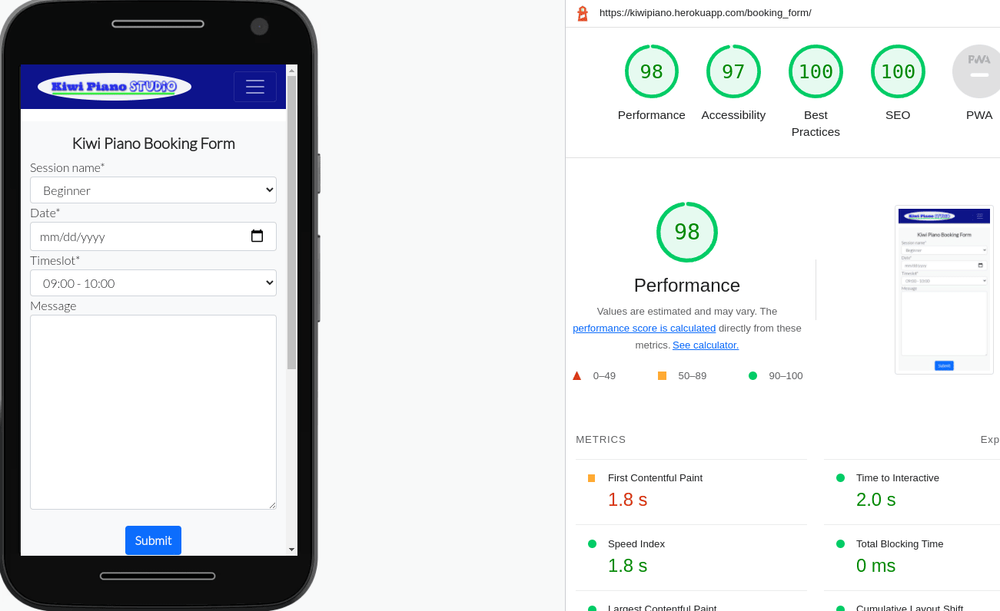

  * Desktop
  
  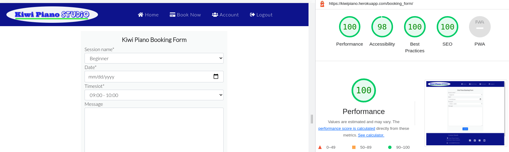

  [Back to top](#testing) 
  
## Manual Testing

* ### Site testing
  
  I manually tested the site's navigation menu links and all buttons accross the site's all pages that all work fine in terms of loading and redirecting URLs to the relavant pages.

* ### Register form testing
  
  I manually tested the register form's password fields. The password needs to meet certain requirements when user regsiter an account.
  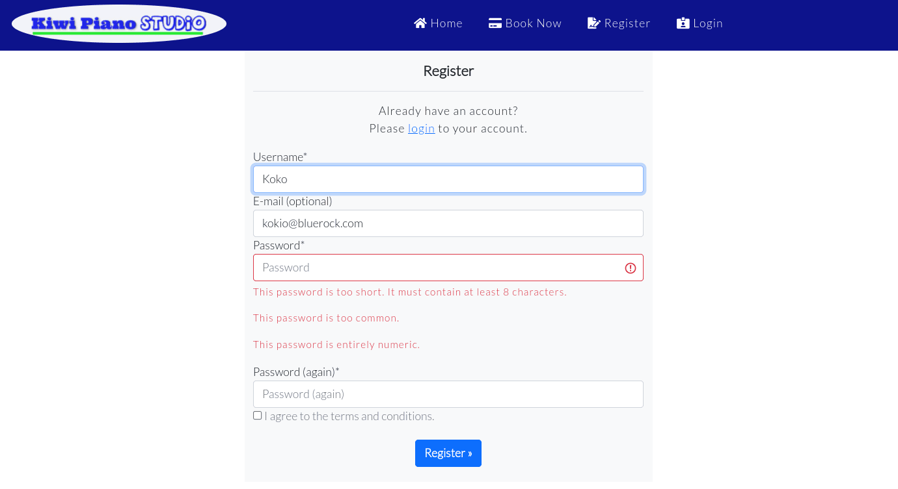

* ### User exists
  
  I manually tested that it's not possible to register an account with the same username or the same email address.

  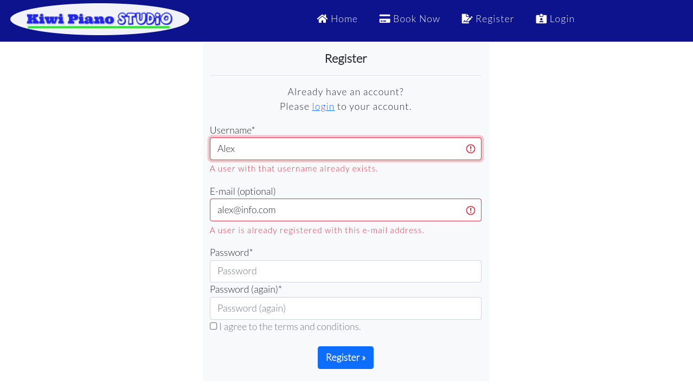

[Back to top](#testing)
* ### Login form testing
  
  I manually tested the login form. The username and the password needs to be the same as user specified when registering an account.
  

[Back to top](#testing)
* ### User profile testing
  
  I manually tested the user profile input fields. The phone number can only be numbers, the first name and the last name are only allowed to have letters.
  

[Back to top](#testing)  
* ### Booking form testing
  
  I manually tested the booking form. The booking date can't be in the past and the booking can only be made ahead of today.

  

[Back to top](#testing)
* ### Admin booking testing
  
  I manually tested that the admin can't change the booking to the past either in the database.
  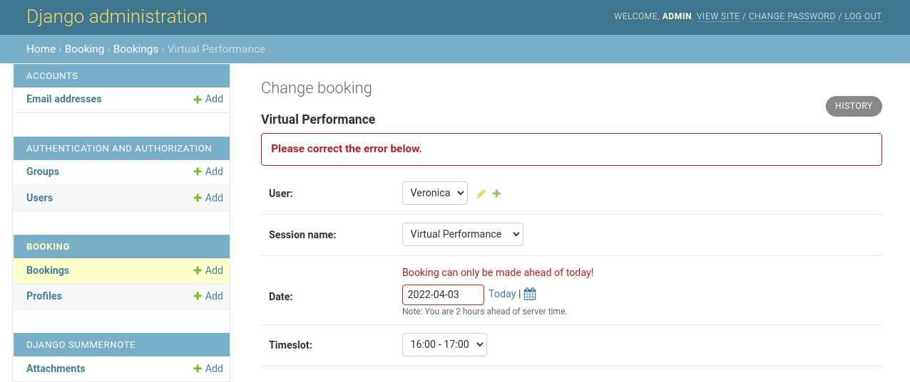

[Back to top](#testing) 

## Automated Testing

* Install coverage.
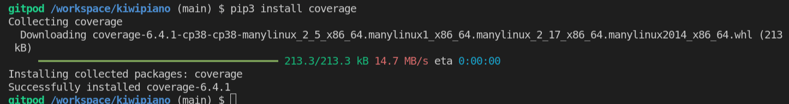

* Coverage report.

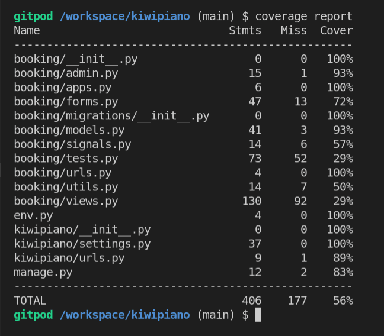


* ### URLs testing
  
  I have tested the URLs and all are ok. In GitPod terminal, run the command ```python3 manage.py test```
  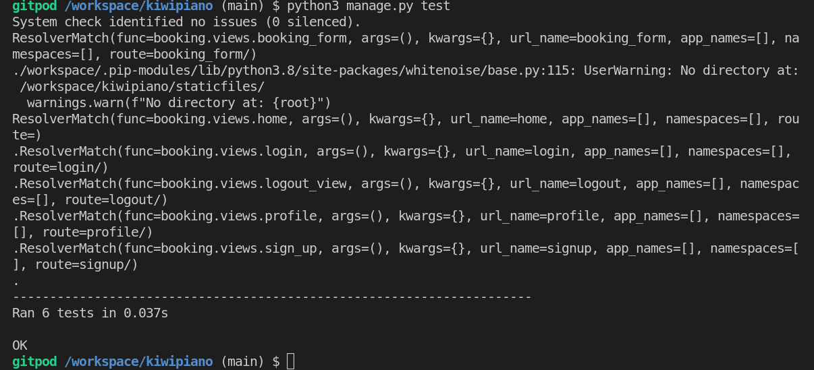

* ### Total testing
  
  The automated tesing result is OK from the tested urls, models, views and forms.
  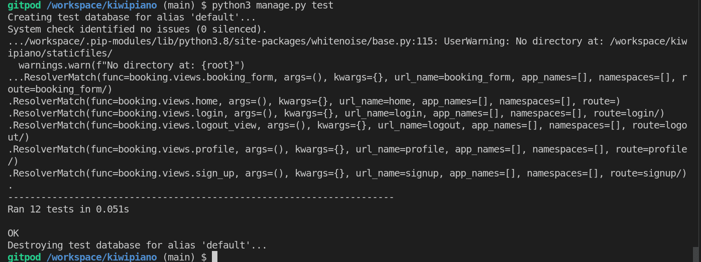
  

## Resolved Known Bugs

  There were some bugs and warnings after checking the markup code by the W3C Markup Validation Service. To solve the problems, I deleted the "id", changed aria-controls attribute, put the space in the nav div tag, and changed the section tag to div on serveral HTML files.

  There were warnings after checking the Python code files using PEP8 online due to the trailing spaces and too many blank lines in between. Then I deleted all the trailing spaces and the blank lines to solve all the warnings. In the end, all errors and warnings are resolved.

  


  [Back to top](#testing) 

## User Story Testing

* ### Admin CRUD / Super User
  | User Story |[#1]() As an admin I can navigate the admin panel so that I can create, read, update and delete the data on the site. |
  |:-------:|:--------|
  | &check; | Admin is able to perform full CRUD functionality. |


* ### New and unregistered User
  | User Story |[#3]() As a first time user I can access the site easily so that I can view the site on any media screens with different browsers. |
  |:-------:|:--------|
  | &check; | The site is **responsive** from 320px up to 4K screens. The site works fine using **Google Chrome**, **Microsoft Edge** and **Safari** browsers. |

  | User Story |[#4]() As a first time user I can navigate the site easily so that I know what the site is about and decide if I am interested or not. |
  |:-------:|:--------|
  | &check; |  The site's pages clearly display the navigatin menu, about section and the session list that user is able find sufficient information at the first time. |

  | User Story |[#5]() As a user I can view the range of session so that I can choose a session that it is suitable for me. |
  |:-------:|:--------|
  | &check; |  There are two separate session lists on the home page that user is able to view the offers. |

  | User Story |[#7]() As a user I can sign up an account so that I can manage my activities with the studio. |
  |:-------:|:--------|
  | &check; |  User is able to register an account by clicking **Register**. User is able to fill in the registration form with personal information to register an account. |

[Back to top](#testing)
* ### Registered User
  | User Story |[#8]() As a registered user I can login / logout so that I can book or cancel a session as well as managing my own account profile. |
  |:-------:|:--------|
  | &check; |  User is able to use her/his username to login to the account and update or delete profile after logged in. |

  | User Story |[#9]() As a registered user I can book a session so that I can select a session suitable for me. |
  |:-------:|:--------|
  | &check; |  When registered user is logged in, user is able to book a sesion using the booking form |

  | User Story |[#10]() As a registered user I can cancel a booking so that I can manage my schedule in case I am not available. |
  |:-------:|:--------|
  | &check; | User is able to update or cancel a session. |

  | User Story |[#11]() As a user I can receive feedback so that I know whether my registration is successful or not, whether my profile is updated or not, and my booking status. |
  |:-------:|:--------|
  | &check; |  User gets a message after register an account, login to the account, update or delete profile as well as update or cancel a booking. |

  | User Story |[#12]() As a register user I can view my booking history so that I have a clear view about my study. |
  |:-------:|:--------|
  | &check; |  User is albe to view the booking list on the profile page. |

  | User Story |[#14]() As a user I can contact the studio so that I can ask any questions regarding my bookings or other things. |
  |:-------:|:--------|
  | &check; |  User is able to make contact to **Kiwi Piano Studio** using the contact details and the social media platforms.|

  | User Story |[#15]() As a registered user I can view and edit my profile so that I know my account details and I can edit and manage my own account as I wish. |
  |:-------:|:--------|
  | &check; |  User is able to view the profile details and update the profile such as user name, first name, last name, email address, phone number and profile image. User is also able to delete the profile. |

[Back to top](#testing)
## Site Owner Stories Testing

  | Site Owner Story |The website is accessible and responsive. It targets the user who would like to learn to play piano or other activities using the studio. |
  |:-------:|:--------|
  | &check; |The site is **responsive** from 320px up to 4K screens. The site works fine using **Google Chrome**, **Microsoft Edge** and **Safari** browsers.|

  | Site Owner Story |The site offers different user interface that user can sign up an account, log in and log out as well as edit the user profile. |
  |:-------:|:--------|
  | &check; | User is able to use her/his username to login to the account and update or delete profile after logged in.     |

  | Site Owner Story | The site has a booking system that user can book a piano session according to user’s interests.|
  |:-------:|:--------|
  | &check; | The site has a booking system where user can book a session, update or cancel the booking.|

  | Site Owner Story | The site offers registered user to view and edit their account profile.|
  |:-------:|:--------|
  | &check; |The site offers the registered user to update or delete user profile and booking.|

  | Site Owner Story | The site offers many different contact methods that user can make contact easily to the piano studio.|
  |:-------:|:--------|
  | &check; | The site has contact details as well as social media site for user to make contact.|

  | Site Owner Story | The site has an admin functionality that admin can manage the site.|
  |:-------:|:--------|
  | &check; | The site has an admin site to manage the data.        |
 

[Back to README.md](README.md)